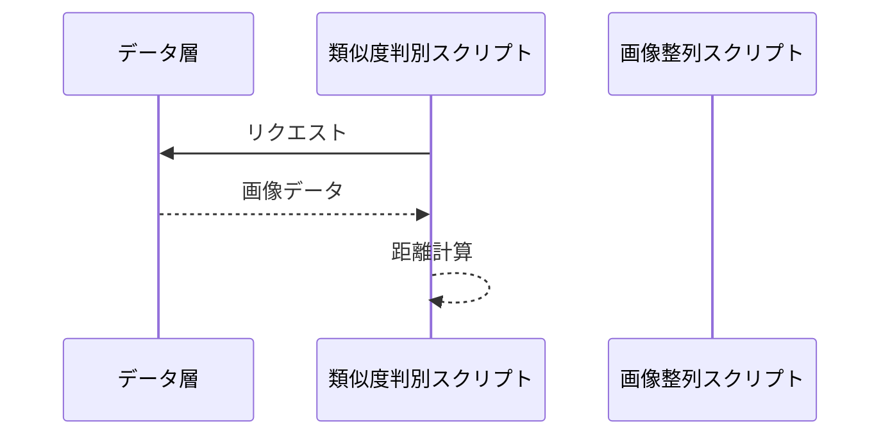

# 開発
> conda activate imgsim
> cd -> 所定のimgsimTestまで移動

01-featureMatching.pyでtrain画像内の距離総当り表を作成
02-calcGravity.pyでselectedフォルダ内の画像から、imgsource内の画像への重力距離を計算する。

# 画像の類似度を判別する
featureMatching.pyでimagesフォルダ内の画像で全ての距離を測定し、export.csvを出力できるようになった。

imagesフォルダに入っている画像
比較元にする画像　001.pngにする

> python calcImageSim.py
として実行
images内の画像の類似度が判定され、類似度名のファイルに変更される。

